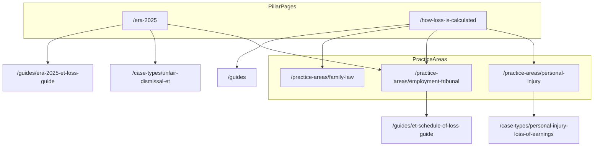

# SEO Architecture: employmentlossexpert.com

**Version:** 1.0  
**Last updated:** June 2025  
**Canonical site:** [https://www.employmentlossexpert.com](https://www.employmentlossexpert.com) (apex redirects to `www` via `middleware.ts`)

---

## Document purpose

This is the single source of truth for SEO on EmploymentLossExpert.com: keyword targeting, content clusters, internal linking, structured data, generative-engine optimization (GEO), off-page targets, competitor monitoring, timing strategy, and deployment. Content, development, and outreach should align to this document.

| Audience | Primary goal |
|----------|----------------|
| PI and clinical negligence solicitors | Loss of earnings, Ogden Tables, Smith v Manchester |
| Employment law solicitors | ET compensation, ERA 2025 uncapped awards, Polkey |
| Family law solicitors | Loss of career, FPR Part 25 employment reports |

**Primary ranking goal:** employment loss expert witness (UK and non-geo variants) and closely related transactional queries.

**Implementation reference:** Routes and data live under `app/`, `lib/data/`, `lib/schema/`, and `lib/seo/publicUrlInventory.ts`. Regenerate sitemap with `npm run seo:generate`.

---

## URL canonicalization

Canonical URLs use **build-spec slugs** (keyword-rich, match H1s and `lib/data/*`). Where the original SEO brief used shorter paths, use the canonical URL below.

| SEO brief (alias) | Canonical URL |
|-------------------|---------------|
| `/case-types/clinical-negligence` | `/case-types/clinical-negligence-employment-loss` |
| `/case-types/personal-injury-loss` | `/case-types/personal-injury-loss-of-earnings` |
| `/guides/ogden-tables-loss-of-earnings` | `/guides/ogden-tables-loss-of-earnings-guide` |
| `/glossary#polkey` | `/glossary#polkey-reduction` |
| `/guides/era-2025-loss-guide` | `/guides/era-2025-et-loss-guide` |

Do not publish duplicate content at alias paths. If aliases are ever needed, use 301 redirects to canonical URLs.

---

## 1. Keyword strategy

### Tier 1 — Transactional

- employment loss expert witness UK
- employment loss expert witness
- loss of earnings expert witness UK
- employment expert witness UK
- ET loss expert witness UK
- employment tribunal expert witness
- loss of earnings report UK solicitors
- wrongful dismissal loss expert
- discrimination loss expert witness UK
- employment loss report PI UK

**Primary landing pattern:** homepage, `/services`, `/contact`, relevant `/practice-areas/*` and `/case-types/*`.

### Tier 2 — Informational

- how is employment loss calculated UK
- what is a Smith v Manchester award
- Ogden Tables loss of earnings explained
- how does ERA 2025 affect ET compensation
- what is a Polkey reduction
- unfair dismissal compensation cap removed
- Vento bands 2025 update
- how is pension loss calculated ET
- loss of career divorce proceedings UK
- employment rights act 2025 unfair dismissal expert witness

**Primary landing pattern:** `/how-loss-is-calculated`, `/era-2025`, `/guides/*`, `/glossary`, `/faq`.

### Tier 3 — Long-tail / case type

- personal injury loss of earnings expert UK
- clinical negligence career loss expert witness
- unfair dismissal ET loss expert 2027
- discrimination employment loss expert UK
- wrongful dismissal LTIP bonus loss expert
- divorce loss of career expert witness UK
- fatal accident earnings trajectory expert
- educational negligence career loss expert UK
- ERA 2025 uncapped unfair dismissal expert evidence
- Smith v Manchester award expert witness UK

**Primary landing pattern:** dedicated `/case-types/[slug]` and `/guides/[slug]` pages.

### Keyword-to-URL matrix

| Keyword | Primary URL | Secondary URLs | Content type |
|---------|-------------|----------------|--------------|
| employment loss expert witness UK | `/` | `/what-is-an-employment-loss-expert`, `/services` | Homepage + definition |
| loss of earnings expert witness UK | `/practice-areas/personal-injury` | `/case-types/personal-injury-loss-of-earnings`, `/services#loss-of-earnings-pi` | Practice area + case type |
| employment tribunal expert witness | `/practice-areas/employment-tribunal` | `/case-types/unfair-dismissal-et`, `/guides/et-schedule-of-loss-guide` | Practice area |
| ET loss expert witness UK | `/practice-areas/employment-tribunal` | `/era-2025`, `/how-loss-is-calculated` | Practice area + pillar |
| loss of earnings report UK solicitors | `/services#loss-of-earnings-pi` | `/how-to-instruct`, `/contact` | Service + conversion |
| wrongful dismissal loss expert | `/case-types/wrongful-dismissal` | `/practice-areas/employment-tribunal` | Case type |
| discrimination loss expert witness UK | `/case-types/discrimination-employment-loss` | `/guides/discrimination-loss-of-earnings` | Case type + guide |
| employment loss report PI UK | `/case-types/personal-injury-loss-of-earnings` | `/guides/ogden-tables-loss-of-earnings-guide` | Case type + guide |
| how is employment loss calculated UK | `/how-loss-is-calculated` | All `/practice-areas/*`, `/glossary` | Pillar (GEO) |
| what is a Smith v Manchester award | `/guides/smith-v-manchester-guide` | `/how-loss-is-calculated`, `/glossary#smith-v-manchester-award` | Guide |
| Ogden Tables loss of earnings explained | `/guides/ogden-tables-loss-of-earnings-guide` | `/how-loss-is-calculated`, `/glossary#ogden-tables-8th-edition` | Guide |
| how does ERA 2025 affect ET compensation | `/era-2025` | `/guides/era-2025-et-loss-guide`, `/practice-areas/employment-tribunal` | Timely pillar |
| what is a Polkey reduction | `/practice-areas/employment-tribunal` | `/glossary#polkey-reduction`, `/era-2025` | Practice area |
| unfair dismissal compensation cap removed | `/era-2025` | `/case-types/unfair-dismissal-et`, `/faq` | Timely pillar |
| Vento bands 2025 update | `/case-types/discrimination-employment-loss` | `/glossary#vento-bands` | Case type |
| how is pension loss calculated ET | `/how-loss-is-calculated` | `/services#pension-loss`, `/glossary#pension-loss` | Pillar section |
| loss of career divorce proceedings UK | `/case-types/divorce-loss-of-career` | `/practice-areas/family-law`, `/guides/family-law-employment-reports` | Case type |
| ERA 2025 unfair dismissal expert witness | `/era-2025` | `/guides/era-2025-et-loss-guide` | Timely pillar |
| personal injury loss of earnings expert UK | `/case-types/personal-injury-loss-of-earnings` | `/practice-areas/personal-injury` | Case type |
| clinical negligence career loss expert witness | `/case-types/clinical-negligence-employment-loss` | `/practice-areas/personal-injury` | Case type |
| unfair dismissal ET loss expert 2027 | `/era-2025` | `/case-types/unfair-dismissal-et` | Timely + case type |
| Smith v Manchester award expert witness UK | `/guides/smith-v-manchester-guide` | `/services#smith-v-manchester` | Guide + service |
| wrongful dismissal LTIP bonus loss expert | `/case-types/wrongful-dismissal` | `/services` | Case type |
| divorce loss of career expert witness UK | `/case-types/divorce-loss-of-career` | `/services#loss-of-career-matrimonial` | Case type |
| fatal accident earnings trajectory expert | `/case-types/fatal-accident-dependency` | `/practice-areas/personal-injury` | Case type |
| educational negligence career loss expert UK | `/case-types/educational-negligence-career-loss` | `/how-loss-is-calculated` | Case type |
| ERA 2025 uncapped unfair dismissal expert evidence | `/era-2025` | `/how-loss-is-calculated`, `/contact` | Timely pillar |

---

## 2. Content cluster map

Eight topical hubs. **Build and refresh priority** (highest first):

1. Hub 2 — ERA 2025 / ET uncapped awards  
2. Hub 7 — How loss is calculated (GEO pillar)  
3. Hub 1 — Personal injury loss of earnings  
4. Hub 3 — ET Schedule of Loss  
5. Hub 5 — Smith v Manchester  
6. Hub 4 — Discrimination and whistleblowing  
7. Hub 6 — Family law / loss of career  
8. Hub 8 — Instruction process  

### Cluster overview (mermaid)



---

### Hub 1: Personal injury loss of earnings

| | |
|--|--|
| **Pillar** | `/how-loss-is-calculated` (PI sections) |
| **Priority** | High (Hub 3 in build order) |
| **Target keywords** | loss of earnings expert witness UK, employment loss report PI UK, Ogden Tables, Smith v Manchester |

**Supporting pages (canonical):**

- `/practice-areas/personal-injury`
- `/case-types/personal-injury-loss-of-earnings`
- `/case-types/clinical-negligence-employment-loss`
- `/case-types/fatal-accident-dependency`
- `/guides/ogden-tables-loss-of-earnings-guide`
- `/guides/smith-v-manchester-guide`
- `/how-loss-is-calculated` (PI / multiplier sections)
- `/glossary#ogden-tables-8th-edition`
- `/glossary#multiplier-multiplicand`
- `/glossary#discount-rate-0-25`
- `/glossary#smith-v-manchester-award`
- `/services#loss-of-earnings-pi`

**Content requirements:** Three-frameworks table (PI row); multiplier/multiplicand step table; Ogden 8 disability definition; 2+ FAQs on PI practice area and PI case types; no em dashes in body copy.

---

### Hub 2: ERA 2025 / ET uncapped awards (highest priority)

| | |
|--|--|
| **Pillar** | `/era-2025` |
| **Priority** | **Highest** — breaking law, first-mover content |
| **Target keywords** | ERA 2025, unfair dismissal cap removed, ET loss expert, employment rights act 2025 |

**Supporting pages:**

- `/practice-areas/employment-tribunal`
- `/guides/era-2025-et-loss-guide`
- `/case-types/unfair-dismissal-et`
- `/how-loss-is-calculated` (ET section)
- `/glossary#employment-rights-act-2025-era-2025`
- `/glossary#polkey-reduction`
- `/glossary#compensatory-award-et`
- `/faq` (ERA 2025 Q&As)
- `/contact` (ERA 2025 intake field)

**Content requirements:** ERA 2025 changes table (change | when | impact on expert evidence); orange alert on homepage linking here; Polkey in uncapped world section; dates: cap removal **1 January 2027**; qualifying period 6 months; protective award 180 days from April 2026; whistleblowing/SSP **6 April 2026** where cited.

---

### Hub 3: ET Schedule of Loss

| | |
|--|--|
| **Pillar** | `/guides/et-schedule-of-loss-guide` |
| **Priority** | High |
| **Target keywords** | ET schedule of loss, employment tribunal loss expert, compensatory award |

**Supporting pages:**

- `/services#et-schedule-of-loss`
- `/practice-areas/employment-tribunal`
- `/case-types/unfair-dismissal-et`
- `/case-types/discrimination-employment-loss`
- `/glossary#schedule-of-loss`
- `/glossary#basic-award-et`
- `/how-loss-is-calculated` (ET Schedule of Loss heads table)

**Content requirements:** Schedule of Loss heads table (basic award, immediate loss, future loss, pension loss, statutory rights, injury to feelings, total); link to ERA 2025 for post-cap methodology.

---

### Hub 4: Discrimination and whistleblowing

| | |
|--|--|
| **Pillar** | `/case-types/discrimination-employment-loss` |
| **Priority** | Medium-high |
| **Target keywords** | discrimination loss expert witness UK, Vento bands 2025, whistleblowing employment loss |

**Supporting pages:**

- `/case-types/whistleblowing-detriment`
- `/guides/discrimination-loss-of-earnings`
- `/practice-areas/employment-tribunal`
- `/glossary#vento-bands`
- `/glossary#injury-to-feelings`
- `/glossary#whistleblowing-protected-disclosure`
- `/services#discrimination-reports`

**Content requirements:** Vento bands table (lower / middle / upper with 2025 figures); distinguish injury to feelings (tribunal) vs financial loss (expert).

---

### Hub 5: Smith v Manchester

| | |
|--|--|
| **Pillar** | `/guides/smith-v-manchester-guide` |
| **Priority** | Medium-high |
| **Target keywords** | Smith v Manchester award, handicap on labour market, PI loss methodology |

**Supporting pages:**

- `/case-types/personal-injury-loss-of-earnings`
- `/how-loss-is-calculated` (Smith section)
- `/services#smith-v-manchester`
- `/glossary#smith-v-manchester-award`

**Content requirements:** When Smith applies vs multiplier/multiplicand; typical award up to 2 years net earnings; comparison table for solicitors.

---

### Hub 6: Family law / loss of career

| | |
|--|--|
| **Pillar** | `/practice-areas/family-law` |
| **Priority** | Medium |
| **Target keywords** | loss of career divorce UK, family law employment expert, FPR Part 25 |

**Supporting pages:**

- `/case-types/divorce-loss-of-career`
- `/guides/family-law-employment-reports`
- `/services#loss-of-career-matrimonial`
- `/glossary#loss-of-career`
- `/glossary#fpr-part-25`
- `/glossary#economic-disadvantage`
- `/glossary#career-gap-analysis`

**Content requirements:** FPR Part 25 and SJE explanation; career gap analysis definition-first; Scotland economic disadvantage note where relevant.

---

### Hub 7: How loss is calculated (master GEO hub)

| | |
|--|--|
| **Pillar** | `/how-loss-is-calculated` |
| **Priority** | Highest after ERA 2025 for AI citation |
| **Target keywords** | how is employment loss calculated UK, multiplier multiplicand, Ogden, ET method |

**Supporting pages:**

- All `/practice-areas/*`
- All methodology `/glossary` terms
- All 6 `/guides/[slug]`
- All `/case-types/*` (cross-links by framework)
- `/faq` (methodology Q&As)
- `/contact`

**Content requirements:** 1,500–2,000+ words; definition-first; three-frameworks comparison table; multiplier step table; ET Schedule of Loss heads table; discount rate section; mitigation section.

---

### Hub 8: Instruction process

| | |
|--|--|
| **Pillar** | `/how-to-instruct` |
| **Priority** | Conversion / trust |
| **Target keywords** | instruct employment loss expert, expert witness fees UK |

**Supporting pages:**

- `/qualifications`
- `/fees`
- `/contact`
- `/faq` (instruction Q&As)

**Content requirements:** Step-by-step by practice area (PI, ET, family); red flags; 7-step matching timeline; Formspree intake with practice area and ERA 2025 fields.

---

## 3. Internal linking rules

### Rule 1: `/how-loss-is-calculated` must link to

- All 3 `/practice-areas/[slug]` pages
- Relevant `/case-types/*` (at least PI, ET, and family exemplars)
- All methodology glossary terms (use fragment URLs from Appendix C)
- `/guides/ogden-tables-loss-of-earnings-guide`, `/guides/smith-v-manchester-guide`, `/guides/era-2025-et-loss-guide`
- `/contact`

### Rule 2: `/era-2025` must link to

- `/practice-areas/employment-tribunal`
- `/how-loss-is-calculated` (ET section anchor when fragment exists)
- `/guides/era-2025-et-loss-guide`
- `/case-types/unfair-dismissal-et`
- `/glossary#polkey-reduction`
- `/contact`

### Rule 3: Every `/practice-areas/[slug]` must link to

- At least 3 relevant `/case-types/[slug]` pages
- Relevant `/services#` sections
- Relevant `/guides/[slug]`
- `/how-loss-is-calculated`
- `/qualifications`
- `/contact`

### Rule 4: Every `/case-types/[slug]` must link to

- Parent `/practice-areas/[slug]`
- Relevant `/services#` section
- Relevant `/guides/[slug]` where applicable
- `/how-loss-is-calculated`
- `/glossary` (2+ key term fragments)
- `/how-to-instruct`
- `/contact`

### Rule 5: Every `/guides/[slug]` must link to

- `/guides` hub
- Relevant `/practice-areas/*`
- Relevant `/case-types/*`
- `/how-loss-is-calculated`
- `/era-2025` (where ERA/ET relevant)
- `/how-to-instruct`
- `/contact`

### Rule 6: Glossary terms must link to

- Most relevant `/practice-areas/*` or `/case-types/*` (see Appendix C)
- `/how-loss-is-calculated` for methodology terms
- `/era-2025` for ERA 2025 terms

### Rule 7: Homepage must link to

- All 3 `/practice-areas/*`
- `/era-2025` (prominent alert)
- All 8 `/services#` anchors
- `/how-loss-is-calculated`
- `/what-is-an-employment-loss-expert`
- `/guides`
- `/faq`
- `/contact`

### Anchor text guidelines

- Use descriptive, UK legal phrasing: e.g. "ET Schedule of Loss guide", "Ogden Tables 8th Edition", "ERA 2025 uncapped awards".
- Avoid "click here", "read more" without context, and bare URLs in visible copy.
- Match user search language where natural (expert witness, loss of earnings, employment tribunal).

### Minimum links per template (development)

| Template | Minimum outbound link types |
|----------|----------------------------|
| Case type | 7 (rules 4) |
| Practice area | 6 (rules 3) |
| Guide | 6 (rules 5) |
| Glossary term | 1 primary `link` in data; add fragment `id` on term for inbound deep links |

**Component pattern:** Implement reusable `RelatedLinks` / `InThisSection` blocks fed from hub metadata in `lib/data/` to enforce rules at build time. Run `scripts/verify-seo.ts` (or future link audit) before release.

**Glossary deep links:** Add `id` attributes on each glossary `<dt>` matching Appendix C fragment IDs (currently terms render without fragment IDs; add for deep linking and Rule 6).

---

## 4. Schema architecture

Structured data is implemented in `lib/schema/` and injected via `components/JsonLd.tsx`.

### Root entity

| Property | Value |
|----------|--------|
| `@id` | `https://www.employmentlossexpert.com/#organization` |
| Type | `Organization` |
| `areaServed` | United Kingdom (`GB`) |
| `sameAs` | LinkedIn (see `LINKEDIN_URL` in `lib/site.ts`) |

### Schema graph by page

| Page(s) | Schema type(s) | Implementation notes |
|---------|----------------|----------------------|
| `/` | `@graph`: Organization, WebSite, ProfessionalService, SearchAction | `organizationSchema()` in `lib/schema/organization.ts`; `hasOfferCatalog` references 8 services |
| `/services` | 8× `Service` | `servicesPageSchema()`; fragment `@id`s below |
| `/how-loss-is-calculated` | `Article` | `articleSchema()`; `about` → `#loss-of-earnings-pi` |
| `/era-2025` | `Article` | `about` → `#et-schedule-of-loss` |
| `/guides/[slug]` ×6 | `Article` | Per-guide `aboutServiceId` in `lib/data/guides.ts` |
| `/faq` | `FAQPage` | 12 Q&As from `lib/data/faq.ts` |
| `/glossary` | `FAQPage` | 32 terms as question/answer pairs |
| `/practice-areas/*` ×3 | `FAQPage` | 2 FAQs per practice area page |
| `/case-types/*` ×10 | `FAQPage` | 2 FAQs per case type |
| All indexed pages except `/thank-you` | `BreadcrumbList` | `breadcrumbSchema()` |

### Service fragment IDs (`/services#…`)

| Fragment | Service |
|----------|---------|
| `#loss-of-earnings-pi` | Loss of Earnings Reports (PI) |
| `#residual-earning-capacity` | Residual Earning Capacity Assessment |
| `#labour-market-analysis` | Labour Market Analysis |
| `#smith-v-manchester` | Smith v Manchester Reports |
| `#pension-loss` | Pension Loss Calculations |
| `#et-schedule-of-loss` | ET Schedule of Loss Preparation |
| `#discrimination-reports` | Discrimination Compensation Reports |
| `#loss-of-career-matrimonial` | Loss of Career (Matrimonial) |

### Exclusions

| Path | Robots | Schema |
|------|--------|--------|
| `/thank-you` | noindex, nofollow | None |
| `/privacy`, `/terms` | noindex, follow | None |
| `/contact` | index (excluded from sitemap only) | BreadcrumbList |

### Validation checklist

- [ ] [Google Rich Results Test](https://search.google.com/test/rich-results) on `/`, `/faq`, `/glossary`, one `/case-types/*`, one `/guides/*`
- [ ] [Schema.org validator](https://validator.schema.org/) on homepage `@graph`
- [ ] Confirm `@id` URLs resolve and match canonical `SITE_URL`
- [ ] No duplicate FAQPage on same URL
- [ ] Article `about` `@id` matches existing Service fragment

---

## 5. GEO optimization targets

Content structured for AI citation and featured snippets: **definition-first**, tables with clear headers, UK-specific figures, solicitor audience.

| # | Asset | Page | Section / anchor | Required structure |
|---|--------|------|------------------|-------------------|
| 1 | Three frameworks comparison | `/how-loss-is-calculated` | The Three Frameworks | Table: Framework \| Court/Tribunal \| Method \| Key Variables |
| 2 | Multiplier / multiplicand steps | `/how-loss-is-calculated` | PI method | Table: Step \| Description \| Tool |
| 3 | ET Schedule of Loss heads | `/how-loss-is-calculated` | ET method | Table: Head \| Calculation |
| 4 | ERA 2025 changes | `/era-2025` | Key Changes at a Glance | Table: Change \| When \| Impact on Expert Evidence |
| 5 | Ogden Tables explanation | `/guides/ogden-tables-loss-of-earnings-guide` | Full guide | 8th Edition, disability definition, reduction factors |
| 6 | Smith v Manchester explained | `/guides/smith-v-manchester-guide` | Full guide | When applicable vs multiplier method |
| 7 | Polkey reduction | `/practice-areas/employment-tribunal` | Polkey section | Definition + uncapped context |
| 8 | Vento bands table | `/case-types/discrimination-employment-loss` | Injury to feelings | Table: Band \| Range (2025 figures) |
| 9 | UK employment statistics | `/` | By the Numbers | Table: Fact \| Figure \| Source |
| 10 | Glossary | `/glossary` | All 32 terms | Term → one-sentence definition → detail → internal link |

**Glossary GEO rule:** First sentence of each definition must stand alone as an answer. Expand below with proceeding context and one canonical internal link (see `lib/data/glossary.ts`).

**Copy rule:** No em dashes (U+2014) anywhere on the site. Use commas, colons, or hyphens.

---

## 6. Off-page SEO targets

### Expert witness directories (submit and monitor monthly)

| Directory | URL / notes |
|-----------|-------------|
| UK Register of Expert Witnesses | jspubs.com |
| Academy of Experts | academyofexperts.org |
| Expert Witness Institute (EWI) | experts.org.uk |
| NAPIER | Professional employment experts in rehabilitation |
| APIL expert directory | APIL membership |
| Resolution | Family solicitors network |
| Law Society expert finder | Law Society |

**Cadence:** Monthly check listing live, category correct (loss of earnings / employment), ERA 2025 and Ogden 8 mentioned in profile.

**UTM pattern for directory and PR links:**

```text
?utm_source={source}&utm_medium=referral&utm_campaign=expert-directory
```

Example: `https://www.employmentlossexpert.com/era-2025?utm_source=jspubs&utm_medium=referral&utm_campaign=expert-directory`

### Legal publications (thought leadership targets)

- Personal Injury Law Journal  
- Employment Law Journal  
- Family Law journal  
- Practical Law (Thomson Reuters)  
- Lexis PSL Employment  
- IDS Employment Law Brief  

### Digital PR angles

1. **ERA 2025:** Why Every Significant ET Case Will Now Need an Employment Loss Expert  
2. **Polkey in an Uncapped World:** The New Employer Defence  
3. **Smith v Manchester vs Multiplier/Multiplicand:** Which Award Should Solicitors Choose?  
4. **Ogden Tables 8th Edition:** What Changed and What Solicitors Need to Know  
5. **Vento Bands 2025 Update:** Current Injury to Feelings Award Ranges  

**LinkedIn:** Company page **EmploymentLossExpert** — link from Organization `sameAs` and footer.

**Outreach owner:** Assign named owner per quarter; track placements in a simple spreadsheet (title, URL, date, follow-up links built).

---

## 7. Competitor monitoring

### Monthly review (first week of month)

| Competitor | URL | Watch for |
|------------|-----|-----------|
| Trevor Gilbert & Associates | employmentexperts.co.uk | ERA 2025 pages, case types, fees |
| Employment Experts Ltd | expertwitness.co.uk (profile 5763c7e0) | ET/PI positioning |
| jspubs loss of earnings | jspubs.com/expert-witness/si/l/loss-of-earnings/ | New listings, keywords |
| jspubs employment prospects | jspubs.com/expert-witness/si/e/employment-prospects/ | Category overlap |
| Paul Jackson Employment | pauljacksonemployment.co.uk | Content depth, Ogden updates |

### Scorecard template

| Signal | Us | Competitor A | Competitor B | Notes |
|--------|-----|--------------|--------------|-------|
| Dedicated ERA 2025 page | Y/N | | | |
| Ogden 8 / disability content | | | | |
| Case type landing pages | | | | |
| Fee guidance published | | | | |
| Schema FAQPage | | | | |
| ET Schedule of Loss guide | | | | |

**Action:** If a competitor publishes ERA 2025 or Ogden 8 content, update our pillar within 2 weeks (statistics, internal links, PR outreach).

---

## 8. Strategic timing

### Advantage 1: Employment Rights Act 2025

- **1 January 2027:** Statutory cap on ordinary unfair dismissal compensatory awards removed; qualifying period reduces to **6 months**.
- **April 2026:** Protective award increases to 180 days (ERA 2025).
- **6 April 2026:** Sexual harassment as qualifying whistleblowing disclosure; SSP changes.

Solicitors are preparing **now**. `/era-2025` and ERA-themed content across ET pages is the **highest-priority SEO opportunity**. No major competitor has dedicated employment **loss expert** ERA 2025 content at time of writing.

**Content calendar:** Publish and refresh ERA content Q2–Q4 2025; spike updates Q4 2026 ahead of cap removal; refresh statistics after commencement.

### Advantage 2: Ogden Tables 8th Edition

Still actively searched by PI solicitors (disability definition, reduction factors). `/guides/ogden-tables-loss-of-earnings-guide` and PI cluster pages capture this demand. Refresh when Ogden Working Group publishes updates.

### Ongoing refreshes

- Vento band figures when Presidential guidance updates  
- ET cap figure until January 2027 (currently £118,223 / 52 weeks)  
- Homepage "By the Numbers" table sources  

---

## 9. Deployment checklist

| Item | Status / location |
|------|-------------------|
| Vercel deployment | Production host |
| DNS: apex → `www` | `middleware.ts` |
| `html lang="en-GB"` | `app/layout.tsx` |
| hreflang `en-GB`, `en-US`, `x-default` | Add to `createMetadata()` `alternates.languages` when US landing variant exists |
| `Lead_notification_url` | Netlify env + `.env.example` (contact form webhook) |
| `NEXT_PUBLIC_SITE_URL` | `https://www.employmentlossexpert.com` — `lib/site.ts` |
| `GOOGLE_SITE_VERIFICATION` | `app/layout.tsx` `metadata.verification.google` |
| `BING_SITE_VERIFICATION` | `app/layout.tsx` `metadata.verification.other` |
| `NEXT_PUBLIC_GA_MEASUREMENT_ID` | Analytics via cookie consent |
| LinkedIn company page | EmploymentLossExpert |
| `public/sitemap.xml` + `robots.txt` | `npm run seo:generate` → `scripts/generate-seo.ts` |
| Directory submissions | jspubs, Academy, EWI, NAPIER, APIL (manual) |

---

## Appendix A: Full route inventory

| Path | Sitemap | Priority | Index |
|------|---------|----------|-------|
| `/` | Yes | 1.0 | Yes |
| `/services` | Yes | 0.95 | Yes |
| `/how-loss-is-calculated` | Yes | 0.95 | Yes |
| `/era-2025` | Yes | 0.95 | Yes |
| `/practice-areas` | Yes | 0.93 | Yes |
| `/practice-areas/personal-injury` | Yes | 0.92 | Yes |
| `/practice-areas/employment-tribunal` | Yes | 0.92 | Yes |
| `/practice-areas/family-law` | Yes | 0.92 | Yes |
| `/case-types` | Yes | 0.92 | Yes |
| `/case-types/personal-injury-loss-of-earnings` | Yes | 0.88 | Yes |
| `/case-types/clinical-negligence-employment-loss` | Yes | 0.88 | Yes |
| `/case-types/unfair-dismissal-et` | Yes | 0.88 | Yes |
| `/case-types/discrimination-employment-loss` | Yes | 0.88 | Yes |
| `/case-types/whistleblowing-detriment` | Yes | 0.88 | Yes |
| `/case-types/wrongful-dismissal` | Yes | 0.88 | Yes |
| `/case-types/divorce-loss-of-career` | Yes | 0.88 | Yes |
| `/case-types/fatal-accident-dependency` | Yes | 0.88 | Yes |
| `/case-types/educational-negligence-career-loss` | Yes | 0.88 | Yes |
| `/case-types/redundancy-settlement-disputes` | Yes | 0.88 | Yes |
| `/what-is-an-employment-loss-expert` | Yes | 0.90 | Yes |
| `/qualifications` | Yes | 0.88 | Yes |
| `/how-to-instruct` | Yes | 0.88 | Yes |
| `/fees` | Yes | 0.88 | Yes |
| `/faq` | Yes | 0.87 | Yes |
| `/guides` | Yes | 0.87 | Yes |
| `/guides/ogden-tables-loss-of-earnings-guide` | Yes | 0.80 | Yes |
| `/guides/era-2025-et-loss-guide` | Yes | 0.80 | Yes |
| `/guides/smith-v-manchester-guide` | Yes | 0.80 | Yes |
| `/guides/et-schedule-of-loss-guide` | Yes | 0.80 | Yes |
| `/guides/discrimination-loss-of-earnings` | Yes | 0.80 | Yes |
| `/guides/family-law-employment-reports` | Yes | 0.80 | Yes |
| `/glossary` | Yes | 0.75 | Yes |
| `/cookies` | Yes | 0.50 | Yes |
| `/contact` | No | — | Yes |
| `/thank-you` | No | — | noindex |
| `/privacy` | No | — | noindex |
| `/terms` | No | — | noindex |

Source of truth for generation: `lib/seo/publicUrlInventory.ts`.

---

## Appendix B: Page-level metadata reference

| Path | Title | Meta description (abridged if long) |
|------|-------|-------------------------------------|
| `/` | Employment Loss Expert Witness UK \| Loss of Earnings & ET Compensation | Qualified UK employment loss expert witness; PI, ET, discrimination, divorce; ERA 2025 ready. |
| `/what-is-an-employment-loss-expert` | What Is an Employment Loss Expert Witness? \| UK Role & Definition | Quantifies financial losses for UK courts and tribunals. |
| `/services` | Employment Loss Expert Witness Services UK \| Full Service List | Loss of earnings, ET schedules, labour market, pension, Smith v Manchester. |
| `/how-loss-is-calculated` | How Employment Loss Is Calculated UK \| Multiplier, Ogden Tables & ET Method | Complete UK guide: multiplier, Ogden, ET Schedules, Smith v Manchester, Polkey. |
| `/practice-areas` | Employment Loss Expert Witnesses by Practice Area \| PI, ET & Family UK | PI, ET, and family law solicitors. |
| `/practice-areas/personal-injury` | Personal Injury Employment Loss Expert Witness UK \| Loss of Earnings & Ogden Tables | PI solicitors: loss of earnings, Smith v Manchester, Ogden. |
| `/practice-areas/employment-tribunal` | Employment Tribunal Loss Expert Witness UK \| ET Compensation & ERA 2025 | ET Schedule of Loss, Polkey, ERA 2025. |
| `/practice-areas/family-law` | Family Law Employment Loss Expert Witness UK \| Divorce & Loss of Career | Loss of career, FPR Part 25. |
| `/era-2025` | Employment Rights Act 2025: Impact on Employment Loss Expert Evidence UK | Cap removal January 2027; expert evidence implications. |
| `/case-types` | Case Types Requiring an Employment Loss Expert Witness \| UK Guide | PI, discrimination, wrongful dismissal, divorce, etc. |
| `/qualifications` | Employment Loss Expert Witness Qualifications UK \| Credentials & Standards | Credentials, CPR Part 35, Ogden 8, ERA 2025. |
| `/how-to-instruct` | How to Instruct an Employment Loss Expert Witness UK \| Step-by-Step Guide | PI, ET, family law instruction steps. |
| `/fees` | Employment Loss Expert Witness Fees UK \| 2025 Report Costs & Hourly Rates | £150–£400/hour typical range; report fees. |
| `/faq` | Employment Loss Expert Witness FAQ UK \| Common Questions Answered | Ogden, Smith v Manchester, Polkey, ERA 2025, fees. |
| `/guides` | Solicitor Guides: Employment Loss Expert Witnesses UK \| PI, ET & Family Law | In-depth solicitor guides. |
| `/glossary` | Employment Loss Expert Witness Glossary \| Key UK Legal Terms | Ogden, Polkey, Smith v Manchester, Vento, ERA 2025. |
| `/cookies` | Cookie Policy \| EmploymentLossExpert.com | GDPR cookie usage and consent. |
| `/contact` | Instruct an Employment Loss Expert Witness \| EmploymentLossExpert.com UK | Submit case details; response within 1 business day. |

Dynamic pages (`/case-types/[slug]`, `/guides/[slug]`) use `metaTitle` and `metaDescription` from `lib/data/case-types.ts` and `lib/data/guides.ts`.

---

## Appendix C: Glossary term index (32 terms)

Fragment IDs are kebab-case derived from the term name. **Implement `id={fragmentId}` on glossary entries** to enable deep linking.

| Term | Fragment ID | Primary internal link |
|------|-------------|-------------------------|
| Basic Award (ET) | `#basic-award-et` | `/practice-areas/employment-tribunal` |
| Career Gap Analysis | `#career-gap-analysis` | `/practice-areas/family-law` |
| Compensatory Award (ET) | `#compensatory-award-et` | `/era-2025` |
| CPR Part 35 | `#cpr-part-35` | `/qualifications` |
| Discount Rate (-0.25%) | `#discount-rate-0-25` | `/how-loss-is-calculated` |
| Economic Disadvantage | `#economic-disadvantage` | `/practice-areas/family-law` |
| Employment Rights Act 2025 (ERA 2025) | `#employment-rights-act-2025-era-2025` | `/era-2025` |
| Equality Act 2010 Protected Characteristics | `#equality-act-2010-protected-characteristics` | `/case-types/discrimination-employment-loss` |
| FPR Part 25 | `#fpr-part-25` | `/practice-areas/family-law` |
| Future Loss of Earnings | `#future-loss-of-earnings` | `/how-loss-is-calculated` |
| The Ikarian Reefer Duties | `#the-ikarian-reefer-duties` | `/qualifications` |
| Injury to Feelings | `#injury-to-feelings` | `/case-types/discrimination-employment-loss` |
| Labour Market Analysis | `#labour-market-analysis` | `/services#labour-market-analysis` |
| Loss of Career | `#loss-of-career` | `/case-types/divorce-loss-of-career` |
| Loss of Statutory Rights | `#loss-of-statutory-rights` | `/guides/et-schedule-of-loss-guide` |
| Mitigation (Employment) | `#mitigation-employment` | `/how-loss-is-calculated` |
| Multiplier/Multiplicand | `#multiplier-multiplicand` | `/how-loss-is-calculated` |
| Ogden Tables (8th Edition) | `#ogden-tables-8th-edition` | `/guides/ogden-tables-loss-of-earnings-guide` |
| Party-Appointed Expert (PAE) | `#party-appointed-expert-pae` | `/how-to-instruct` |
| Past Loss of Earnings | `#past-loss-of-earnings` | `/how-loss-is-calculated` |
| Pension Loss | `#pension-loss` | `/services#pension-loss` |
| Polkey Reduction | `#polkey-reduction` | `/practice-areas/employment-tribunal` |
| Protective Award | `#protective-award` | `/era-2025` |
| Residual Earning Capacity | `#residual-earning-capacity` | `/services#residual-earning-capacity` |
| Schedule of Loss | `#schedule-of-loss` | `/guides/et-schedule-of-loss-guide` |
| Single Joint Expert (SJE) | `#single-joint-expert-sje` | `/how-to-instruct` |
| Smith v Manchester Award | `#smith-v-manchester-award` | `/guides/smith-v-manchester-guide` |
| Vento Bands | `#vento-bands` | `/case-types/discrimination-employment-loss` |
| Vocational Rehabilitation | `#vocational-rehabilitation` | `/services#residual-earning-capacity` |
| Whistleblowing (Protected Disclosure) | `#whistleblowing-protected-disclosure` | `/case-types/whistleblowing-detriment` |
| Wrongful Dismissal | `#wrongful-dismissal` | `/case-types/wrongful-dismissal` |
| Zero-Hours Contract (ERA 2025 changes) | `#zero-hours-contract-era-2025-changes` | `/era-2025` |

---

## Appendix D: Implementation status

| Area | SEO doc | Built in repo | Notes |
|------|---------|---------------|-------|
| Core routes (~24 pages) | Defined | Yes | `app/**/page.tsx` |
| Case types ×10 | Defined | Yes | `lib/data/case-types.ts` |
| Guides ×6 | Defined | Yes | `lib/data/guides.ts` |
| Glossary ×32 | Defined | Yes | Fragment `id`s on terms per Appendix C |
| Internal linking (`RelatedLinks`) | Defined | Yes | `lib/data/seo-related-links.ts` |
| `/experts` | Removed | N/A | No fabricated profiles; `/experts` 301 → `/contact` |
| JSON-LD Organization/Services | Defined | Yes | `lib/schema/organization.ts` |
| FAQPage schema | Defined | Yes | FAQ, glossary, PA, case types |
| Article schema | Defined | Yes | Pillar, era-2025, guides |
| `public/sitemap.xml` | Defined | Generate via script | `npm run seo:generate` |
| hreflang en-GB / x-default | Defined | Yes | `createMetadata()` alternates.languages |
| Internal linking rules | Defined | Partial | `RelatedLinks` on hubs, PA, case types, guides |
| Directory submissions | Defined | Manual | Off-site |
| GEO tables | Defined | Verify on live pages | Content review per §5 |

---

## Appendix E: Content guardrails

1. **No em dashes** (Unicode U+2014). Use commas, colons, parentheses, or hyphens.  
2. **UK English** and solicitor-facing tone (precise, professional, not consumer).  
3. **Legal dates must be accurate:**  
   - Unfair dismissal cap removal: **1 January 2027**  
   - Qualifying period 6 months: **1 January 2027**  
   - Protective award 180 days: **April 2026**  
   - Whistleblowing sexual harassment / SSP: **6 April 2026** where cited  
4. **Sources** for statistics tables (ERA 2025, Equality Act 2010, Civil Liability Act 2018, Ogden 8th Edition, Vento 2025).  
5. **Disclaimer** on all pages: referral service, not a law firm, not legal advice.  
6. **ERA 2025 framing:** Expert evidence becomes essential for significant ET cases under uncapped regime; do not overstate legal advice.  
7. **Injury to feelings:** Clarify Vento is tribunal-assessed; experts handle financial heads only.  

---

*End of SEO Architecture document.*
